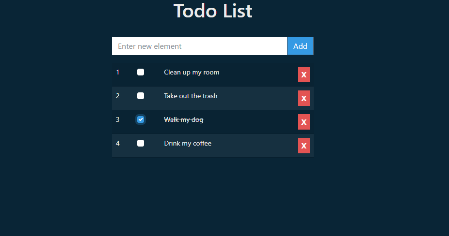

# todo-app-react

Create Todo List application using React.

Live demo: https://mf256.github.io/todo-app-react

## Table of contents

- [General info](#general-info)
- [Technologies](#technologies)
- [Features](#features)
- [Screenshots](#screenshots)
- [Setup](#setup)
- [Status](#status)
- [License](#license)

## General info

Goal of project is to create simple Todo List application using React framework.

## Technologies

- [React](https://react.dev/)
- [Bootstrap](https://getbootstrap.com/)
- [Bootswatch](https://bootswatch.com/)
- [Prettier](https://prettier.io)

## Features

- Add new item
- Set item as done
- Remove item

## Screenshots

## Setup

How to run this project.

1. Clone this repo

2. To run, go to project folder and run

`$ npm install`

3. Now start dev server by running -

`$ npm run start`

4. visit - http://localhost:3000/

To create production ready codes -

`$ npm run build`

for more commands refer `package.json`

## Status

Project is finished.

## License

MIT
